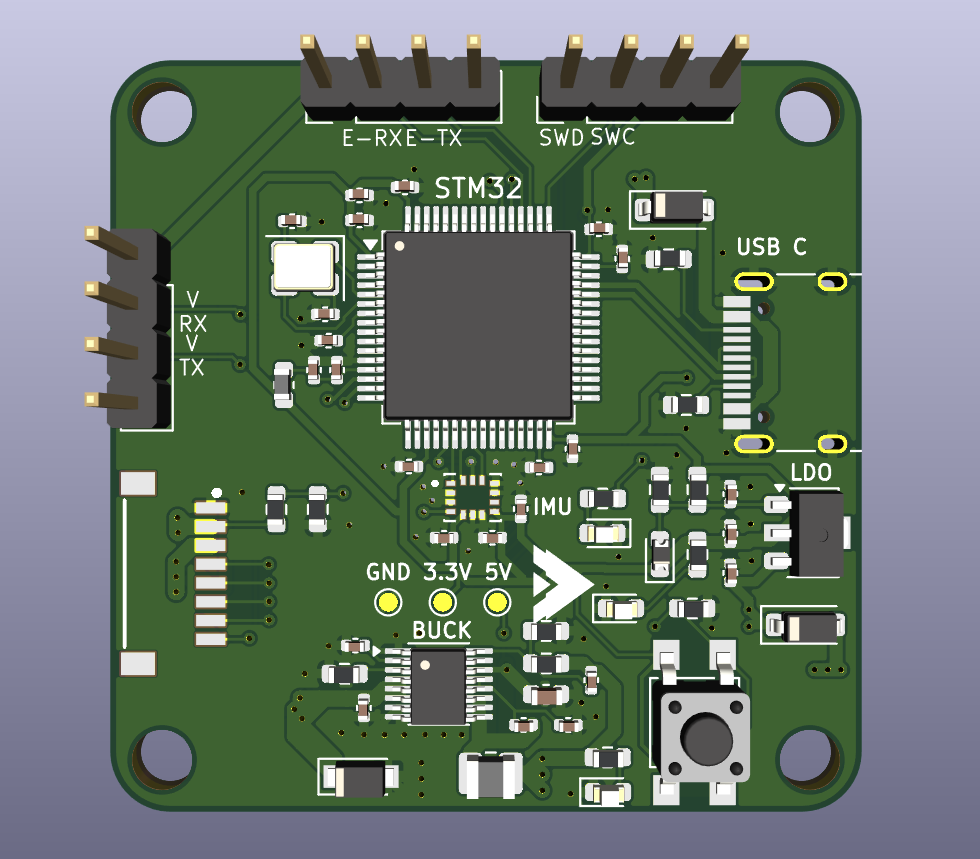
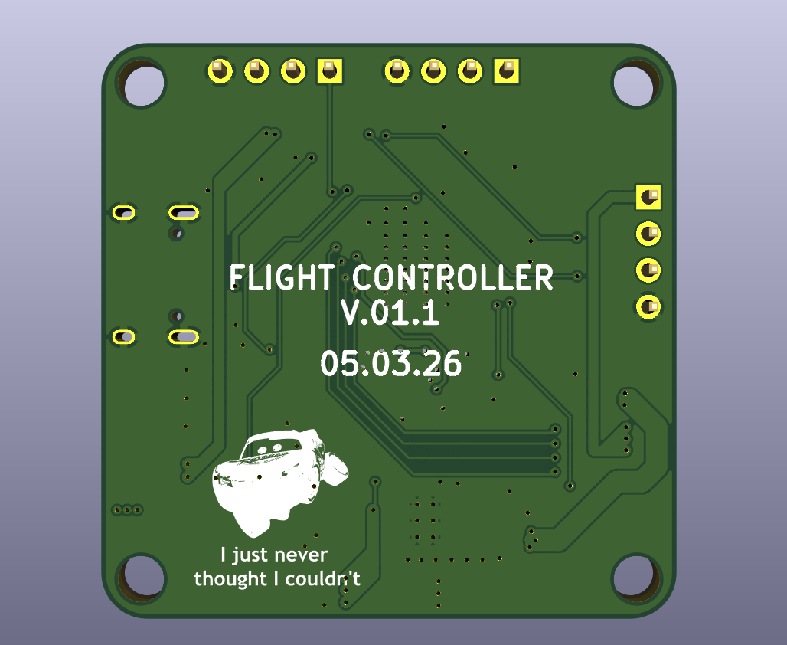

# STM32F405RGT6 Drone Flight Controller

## Custom-designed 4-layer Flight Controller

This project focuses on PCB design around the STM32F405 MCU. It features a 4-layer PCB with dedicated ground and power planes with an integrated IMU.

### Components and Specifications

* Microcontroller: STM32F405RGT6
* IMU: ICM-42670-P
* Power Management: 5V BUCK - LT8610, 3.3V LDO - LT1117-ADJ

The board is designed according to JLCPCB's manufacturing constraints, and the BOM is for LCSC parts.

1.  **Fabrication:** Upload the **V01.2_2.zip** file from the '/production' folder. Use a **4-layer** setting and a **1.6mm** board thickness.
2.  **Sourcing:** Use the provided **V01.2_2_bom.csv** file from the '/production' folder for automated part sourcing.
3.  **Assembly:** Reference the **V01.2_2_positions** file from the '/production' folder if using SMT assembly services, or use the silkscreen markings for manual soldering.
4.  **Datasheets:** STM32F405RGT6 - [stm32f405rg.pdf](https://github.com/user-attachments/files/26315604/stm32f405rg.pdf)
                    LT8610 - [LT8610 - datasheet.pdf](https://github.com/user-attachments/files/26315737/LT8610.-.datasheet.pdf)
                    LT1117 - [LT1117.PDF](https://github.com/user-attachments/files/26315667/LT1117.PDF)
                    ICM-42670-p - [ICM-42688-P.PDF](https://github.com/user-attachments/files/26315769/ICM-42688-P.PDF)

